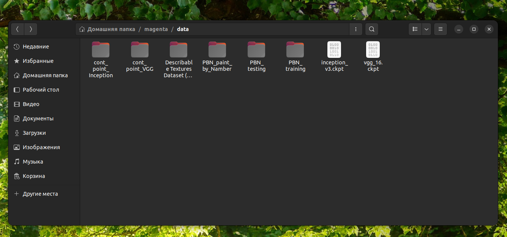
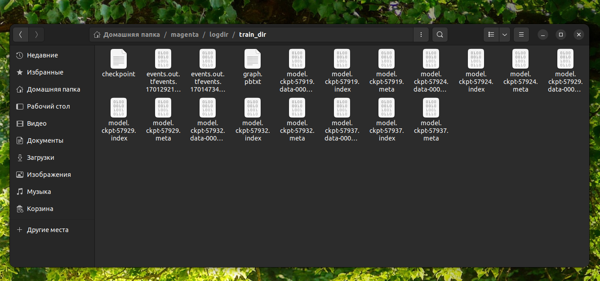
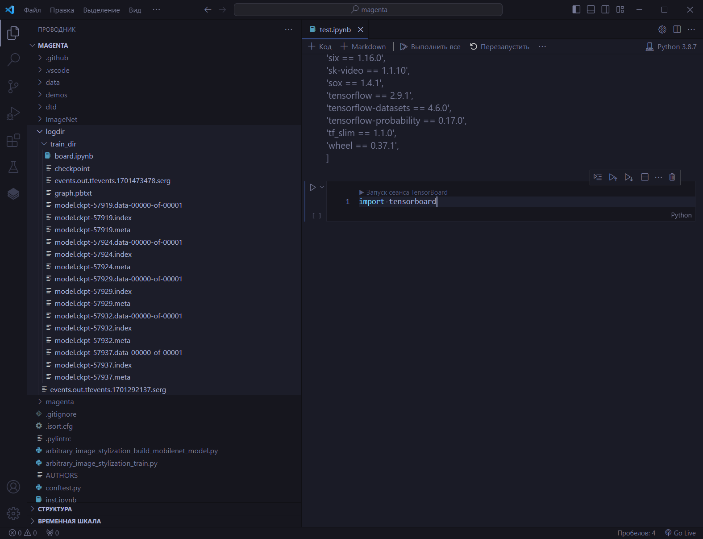
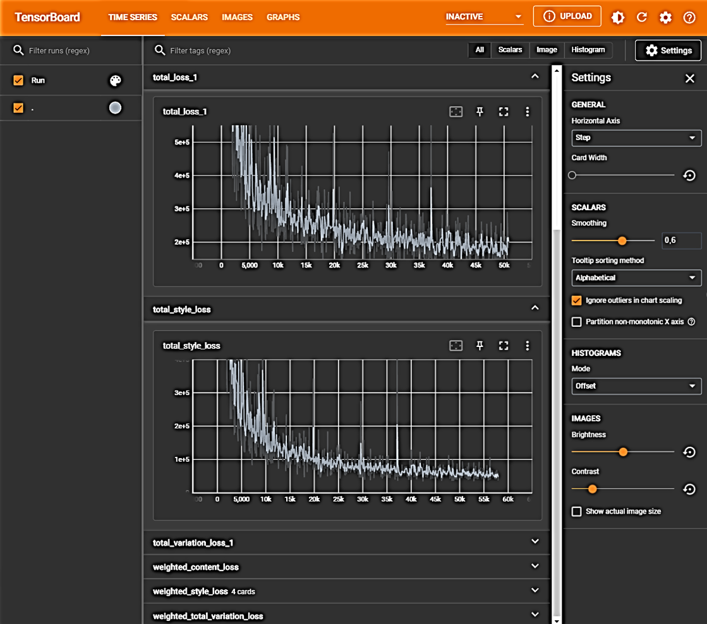
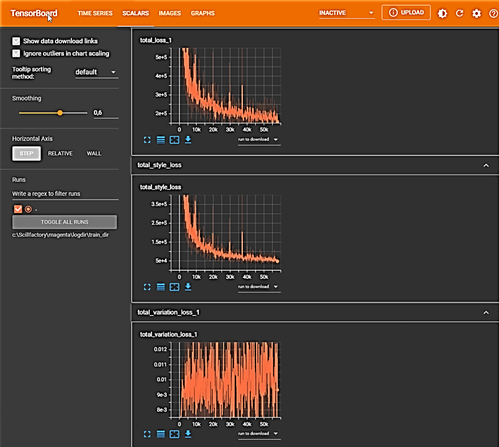
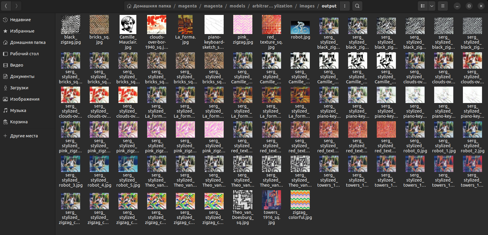
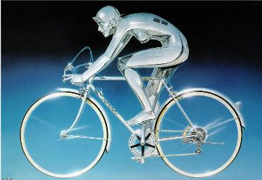
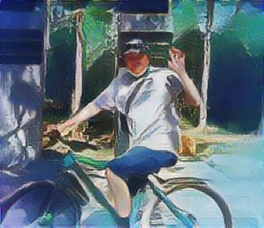
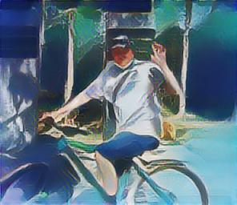

<div align="center">
  
# Проект-4: перенос стиля на мобильном устройстве

</div>  
  
## Содержание
[Введение](./README.md#Введение)<br> 
[Установка magenta](./README.md#Установка)<br>
[Обучение](./README.md#Обучение)<br>
[Стилизация](./README.md#Стилизация)<br>
[Работа в studio-android](./README.md#Studio-Android)<br>
[Mobile Application](./README.md#Mobile-Application)

## Введение  
Проект состоит из двух частей:  
<ul>
<li>обучение нейросети и получение стилизованных изображений;</li>
<li>создание приложения для `android's` и получение стилизованных изображений на смартфоне.</li>
</ul>

В качестве безлайна для проекта, согласно задания, использовался этот [репозиторий](https://github.com/magenta/magenta/tree/main) с magenta. Репозиторий устарел, авторы предупреждают, что он не активен. Тем не менее, нужно установить magenta, запустить её и обучить модель.  
Затем необходимо создать `apk`-приложение для мобильных девайсов и продемонстрировать его работу.  
  
:arrow_up: [Содержание](./README.md#Содержание)  
  
## Установка
Множественные попытки установить `magenta` на Windows ни к чему не привели. Пришлось устанавливать UBUNTU, затем ─ CONDA. Нужна была среда с очень старыми версиями. Конда помогла в этом. Запустив установку согласно [описания](https://github.com/magenta/magenta/tree/main), `magent`-у поставить не удалось (завершилось ошибкой), но удалось получить среду `magenta` в конде. С помощью `conda-navigator` доустановил необходимые модули, и `magenta` наконец-то установилась.  

:arrow_up: [Содержание](./README.md#Содержание)  

## Обучение  
Чтобы начать обучение необходимо иметь:  
<ul>
  <li>Набор данных DTD;</li>
  <li>ImageNet;</li>
  <li>checkpoint VGG-16;</li>
  <li>checkpoint Inception-v3.</li>
</ul>  

Все данные удалось загрузить без проблем. Но с ImageNet это проделать не удалось, так как он огромен, чтобы его загрузить нужно зарегестрироваться и внести оплату. Удалось найти пять train-файлов ImageNet в формате TFRecords. Все данные на GitHub, конечно же вложить невозможно ─ общий размер превышает 60 ГБ. Поэтому я использовал скриншоты. Так как все команды выполнялись интерактивно, то есть, в терминале UBUNTU, то здесь нет ноутбука (.ipynb). Здесь показаны чек-понинты:  
  


Запустив обучение согласно [команде](https://github.com/magenta/magenta/tree/main/magenta/models/arbitrary_image_stylization#training-a-model) я получил следующие результаты:  

  



Здесь не записываются все 50000 (и более) точек, записывается лишь определённое количество (как в скользящем среднем). Tensorboard показал такую информацию:  

  
  
  

## Стилизация
Получить стилизованное изображение оказалось просто ─ достаточно было выполнить в терминале эту команду:  

```python
logdir=/path/to/logdir  
$ arbitrary_image_stylization_train \  
      --batch_size=8 \  
      --imagenet_data_dir=/path/to/imagenet-2012-tfrecord \  
      --vgg_checkpoint=/path/to/vgg-checkpoint \  
      --inception_v3_checkpoint=/path/to/inception-v3-checkpoint \  
      --style_dataset_file=$RECORDIO_PATH \  
      --train_dir="$logdir"/train_dir \  
      --content_weights={\"vgg_16/conv3\":2.0} \  
      --random_style_image_size=False \  
      --augment_style_images=False \  
      --center_crop=True \  
      --logtostderr  
```

После чего в выходной папке с изображениями появились стилизованные картинки:  

  

И вот что со мной сделал роботизированный велосипедист:  

  

<div align="center">
  
     
  
     
  
     

     

     

     
</div>

:arrow_up: [Содержание](./README.md#Содержание)  

## Studio-Android
Studio-Android одинаково нормально установилась и в Windows и в UBUNTU. Но тоже не без фокусов ─ пока разобрал один маленький пункт, а именно: как в студии сделать `app`-файл ─ прошло больше недели. Тем не менее, файл создан и лежит он [здесь](https://drive.google.com/file/d/1j6jNQeSPbFHu24K5T7GxeGGPk5teir7M/view?usp=sharing).


